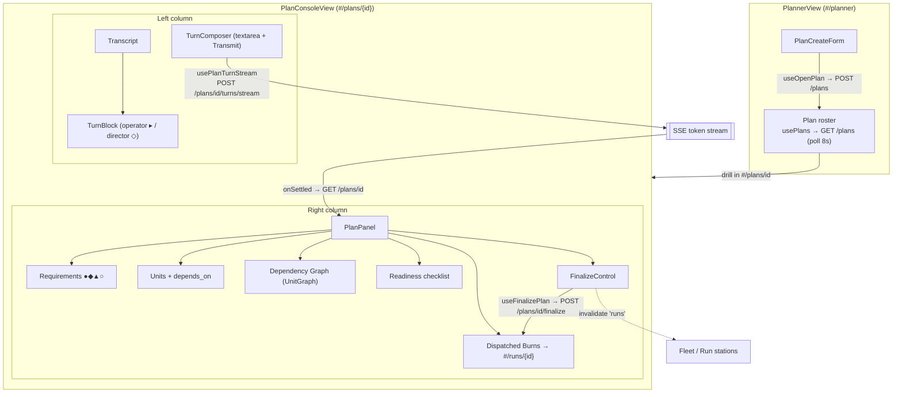
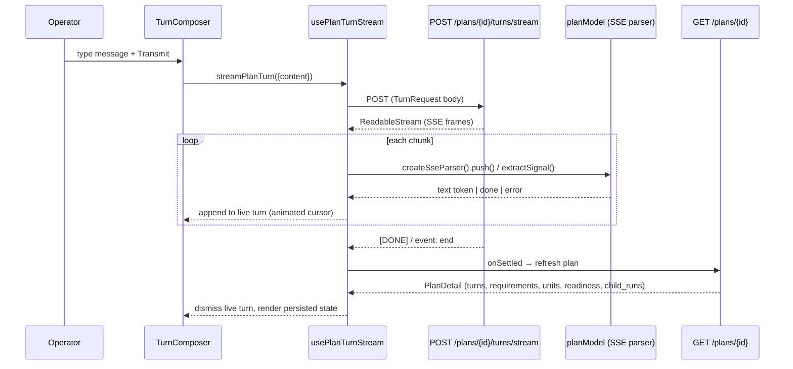
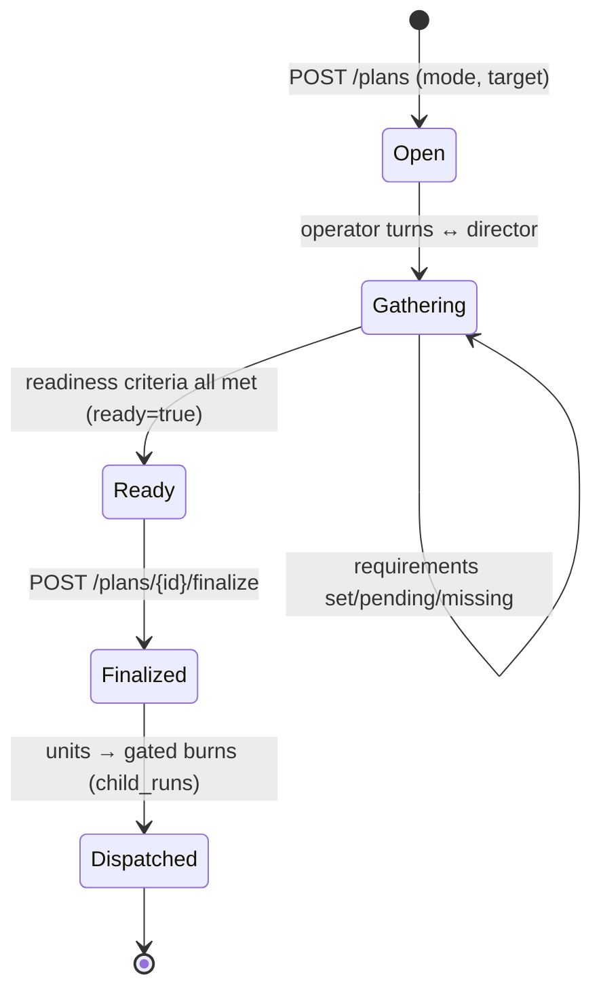
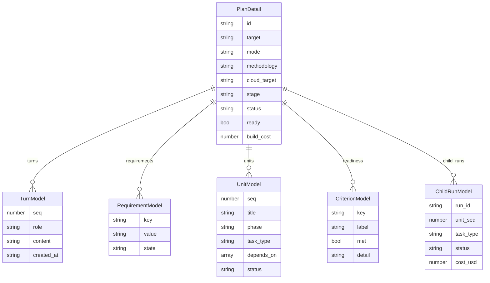

# Planner (INCEPTION · Flight Plans)

The Planner is Mission Control's ingestion point. An operator opens a **planning
session** against a target, converses with the Flight Director (an LLM) to
accrete requirements, and the session decomposes the work into a **work-list of
units**. Once the readiness gate goes GO, the operator **finalizes** the plan and
its units are dispatched as gated burns onto the Fleet.

All source lives under `web-spa/src/features/planner/`. This document maps the
feature, its data, and the backend gaps that limit how much detail the UI can
render today.

---

## 1. File structure

```mermaid
graph TD
    root["web-spa/src/"]
    root --> planner["features/planner/"]
    root --> api["api/"]
    root --> app["App.tsx — routes #/planner, #/plans/{id}"]

    planner --> pv["PlannerView.tsx — plan roster + NEW PLAN"]
    planner --> pcv["PlanConsoleView.tsx — session hero"]
    planner --> pcf["PlanCreateForm.tsx — NEW FLIGHT PLAN form"]
    planner --> pp["PlanPanel.tsx — live Flight Plan"]
    planner --> ug["UnitGraph.tsx — unit dependency DAG (prototype)"]
    planner --> tr["Transcript.tsx — INCEPTION session"]
    planner --> fc["FinalizeControl.tsx — go/no-go dispatch"]
    planner --> up["usePlanner.ts — TanStack Query bindings"]
    planner --> upts["usePlanTurnStream.ts — SSE streaming hook"]
    planner --> pm["planModel.ts — SSE parsing + presentation + DAG layout"]

    api --> client["client.ts — HTTP client (plan fns)"]
    api --> schema["schema.ts — generated OpenAPI types"]
    api --> idx["index.ts — re-exports"]
```



---

## 2. Component hierarchy & data flow



- **Plan list** — `usePlans(query)` polls `GET /plans` every `PLANS_POLL_MS`
  (8 s) with `keepPreviousData` so the board holds across refetches.
- **Plan aggregate** — `usePlan(id)` reads `GET /plans/{id}` and is **not**
  polled; it mutates only via operator turns and finalize, which invalidate the
  key explicitly.
- **Streaming turn** — `usePlanTurnStream` POSTs the turn and reads the response
  body as a `ReadableStream` (native `EventSource` can't carry a request body),
  parsing SSE frames incrementally.

---

## 3. Streaming turn sequence



The parser (`planModel.ts`) is deliberately tolerant: an OpenAI-style `[DONE]`,
a named `event: end`, a `{done:true}` flag, a bare-text `data:`, or a JSON token
envelope all resolve correctly. Structured frames are ignored mid-stream — the
authoritative state comes from re-reading `GET /plans/{id}` once the turn
settles.

---

## 4. Plan lifecycle

> **Inferred.** `stage` and `status` are free-form strings in the seam contract
> (see §6). This is the shape the UI assumes, not a contract the backend
> enforces.



---

## 5. API ↔ data model map

| Endpoint | Method | Request | Response |
|---|---|---|---|
| `/plans` | GET | query: `status?`, `mode?`, `target?`, `limit?`, `offset?`, `order?` | `PlanList` |
| `/plans` | POST | `OpenPlanRequest` | `PlanDetail` |
| `/plans/{id}` | GET | — | `PlanDetail` |
| `/plans/{id}/turns` | POST | `TurnRequest` | `TurnResponse` |
| `/plans/{id}/turns/stream` | POST | `TurnRequest` | SSE stream |
| `/plans/{id}/finalize` | POST | — | `PlanDetail` |



---

## 6. Data sufficiency & backend gaps

Everything above renders from data the backend already returns via
`GET /plans/{id}`. The table below tracks what is thin and what the backend
would need to generate for richer in-app detail.

| Detail | Available now? | Gap / backend need |
|---|---|---|
| Requirements list + state | ✅ | `RequirementModel` complete |
| Units with dependencies | ⚠️ Partial | `depends_on` is `unknown[]` — no guarantee it's resolvable seq refs |
| Readiness checklist | ✅ | `CriterionModel` complete |
| Plan lifecycle stages | ⚠️ Weak | `stage`/`status` free-form `string` — the §4 state machine is inferred |
| Per-unit phase grouping / timeline | ⚠️ Partial | `phase` exists, no ordering/duration metadata |
| Cost breakdown | ⚠️ Partial | `build_cost` + per-run `cost_usd`, but no pre-dispatch per-unit estimate |
| Requirement → unit traceability | ❌ | Nothing links which requirement drove which unit |

### Prototype status: unit dependency DAG

`UnitGraph.tsx` renders a left→right DAG from `units[].depends_on` **against the
current untyped data** (`PlanPanel` shows it once any resolvable edge exists).
`buildUnitGraph()` in `planModel.ts`:

- keeps only numeric seq refs (`dependsSeqs`), dropping non-numeric identifiers,
  self-references, and refs to unknown units;
- assigns each unit a column = its longest dependency chain (edges always point
  rightward), breaking any cycle defensively so layout always terminates;
- **reports the dropped-ref count** in the graph footer, so the view is honest
  that the DAG is only as complete as the untyped field allows.

This prototype is the concrete argument for the `depends_on` typing change
below: today the graph silently degrades whenever a dep isn't a numeric seq.

### Proposed backend schema changes

The following OpenAPI (`components.schemas`) changes would close the gaps and let
the UI render a reliable DAG, a stage tracker, a phase timeline, and
requirement→unit traceability. Written against the current `schema.ts` shapes.

**1. Type `depends_on` as unit seq refs** — enables the DAG without lossy parsing.

```yaml
UnitModel:
  properties:
    depends_on:
      type: array
      items: { type: integer }   # was: items: {} (→ unknown[])
      description: Seqs of units that must complete before this one.
```

**2. Enumerate `stage` + expose allowed transitions** — makes §4 a contract, not
a guess. Add a stage enum on the plan and, ideally, a small transitions map the
UI can render as a live tracker.

```yaml
PlanDetail:
  properties:
    stage:
      type: string
      enum: [open, gathering, ready, finalized, dispatched]
    stage_transitions:            # optional but ideal
      type: array
      items:
        type: object
        properties:
          from: { type: string }
          to:   { type: string }
```

**3. Order phases + add duration metadata** — enables a phase timeline/Gantt.

```yaml
PlanDetail:
  properties:
    phases:
      type: array
      items:
        type: object
        properties:
          slug:     { type: string }
          label:    { type: string }
          order:    { type: integer }
          est_seconds: { type: integer, nullable: true }
```

**4. Link units back to requirements** — enables requirement→unit traceability.

```yaml
UnitModel:
  properties:
    requirement_keys:
      type: array
      items: { type: string }     # RequirementModel.key values this unit satisfies
```

**5. Per-unit cost estimate** — enables a pre-dispatch cost projection alongside
the existing `build_cost` (reconciled) and per-run `cost_usd`.

```yaml
UnitModel:
  properties:
    est_cost_usd:
      type: number
      nullable: true
      description: Projected cost before dispatch; null when not estimable.
```

After any backend change, regenerate the typed client with
`npm run gen:api` (writes `src/api/schema.ts`).
